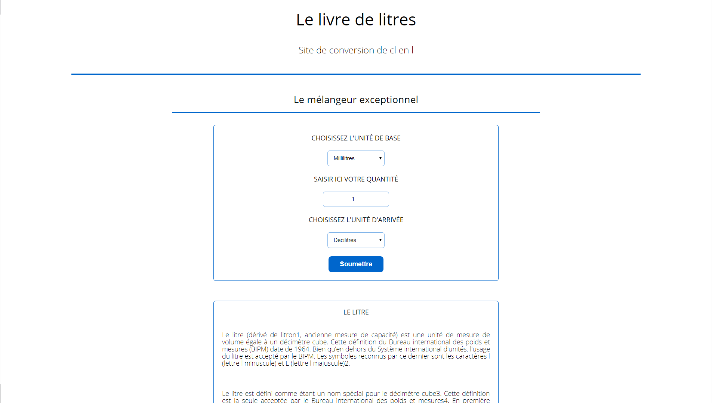

# Site de conversion de centilitres en litres

Il s'agit d'un site qui m'a permis de revoir une partie de ce que je connaissais et ce que j'ai appris en environ une semaine en PHP.  
On peut retrouver dans le site une partie avec une conversion de cl en l ainsi qu'une page formulaire qui permet de soumettre de nouvelle conversion à ajouter. 
Pour le moment, aucune informations n'est stockées, les demandes ne peuvent donc être traitées.

## Langages utilisés
- HTML
- CSS
- PHP

## A faire
- Ajouter un choix qui permet de choisir la conversion de base (le point de départ)
- Ajouter la conversion d'arrivée (le rendu) en fonction du choix de l'utilisateur
- Améliorer le formulaire
- Traiter le formulaire
- ~~Faire un nouveau design~~

## Prérequis
- Lancer le projet à partir d'un serveur (local ou non)
    - Si local, nécessite l'installation d'un logiciel de type uWamp (apache)

## Auteur(s)
<ul>
  <li> Rémy Plt - <i> Travail Initial / Base du site </i> - <a href="https://github.com/Remplt"> Remplt </a>
</ul>
